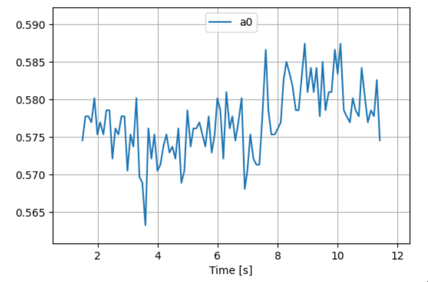

.. nb2214-micropython documentation master file, created by
   sphinx-quickstart on Mon Jan 15 21:55:12 2024.
   You can adapt this file completely to your liking, but it should at least
   contain the root `toctree` directive.

Welcome to nb2214-micropython's documentation!
==============================================

.. toctree::
   :maxdepth: 2
   :caption: Contents:

.. image:: images/ALPACA_overview.png
  :align: center
  :width: 800
  :alt: An image of the ALPACA board.

Welcome to the documentation for the NB2214 MicroPython port, the programming
language used to program the ALPACA board. This port is based on `MicroPython`_
lightweight implementation of the Python everybody is familiar with designed
for microcontrollers such as the one found on the ALPACA.

In the sections below, the features of the `nb2214-micropython` port are
outlined, with links to their documentation.

.. _`MicroPython`: https://micropython.org/

Features
--------

MicroPython
~~~~~~~~~~~

.. image:: images/micropython_logo.png
  :align: center
  :width: 300
  :alt: The MicroPython logo.

|

The ALPACA is controlled by the Raspberry Pi Pico. The `nb2214-micropython`
port extends on the features of Micropython. Import features included in
base Micropython are:

* Control of digital output pins via `machine.Pin`_.
* Control of analog input pins via `machine.ADC`_.
* Delay and timing via the `time`_ module.

.. seealso::
   `Quick reference for the RP2`_.
      Online documentation for MicroPython, the programming language of the ALPACA.
   `machine.Pin`_
      Class for controlling the digital output pins of the ALPACA.
   `machine.ADC`_
      Class for controlling the analog input pins of the ALPACA.
   `time`_
      Module for timing and introducing delays.

.. _`machine.Pin`: https://docs.micropython.org/en/v1.18/library/machine.Pin.html#machine-pin
.. _`machine.ADC`: https://docs.micropython.org/en/v1.18/library/machine.ADC.html#machine-adc
.. _`time`: https://docs.micropython.org/en/v1.18/library/time.html#module-time
.. _`Quick reference for the RP2`: https://docs.micropython.org/en/v1.18/rp2/quickref.html

Array Operations with `numpy`
~~~~~~~~~~~~~~~~~~~~~~~~~~~~~~

Harness the capabilities of numerical computing with the inclusion of `numpy`
in this MicroPython port. Perform array operations, mathematical computations,
and data manipulations seamlessly as you are used to in regular Python.

This feature is made possible thanks to `ulab`_, `numpy`-like module for
MicroPython. `ulab` implements a small subset of the features of `numpy`
(and `scipy`). Note that this means that not all `numpy` functions are available
on the ALPACA.

.. seealso::
   `ulab reference`_
      Online documentation for `ulab`, which provides `numpy` functionality for the ALPACA.

.. note::
   In the `ulab reference`_, the module is imported using::

      >>> from ulab import numpy as np

   On the ALPACA, this can be simplified to the usual::

      >>> import numpy as np

.. _`ulab`: https://micropython-ulab.readthedocs.io/en/latest/ulab-intro.html
.. _`ulab reference`: https://micropython-ulab.readthedocs.io/en/latest/

Plotting with `matplotlib.pyplot`
~~~~~~~~~~~~~~~~~~~~~~~~~~~~~~~~~~

The MicroPython port includes a simplified interface for plotting using the
`matplotlib.pyplot` module. You can create visualizations
directly in Jupyter, making it easy to analyze data or monitor outputs.

.. seealso::
   Module :py:mod:`matplotlib.pyplot`
      Documentation for the :py:mod:`matplotlib.pyplot` module.
   :py:func:`matplotlib.pyplot.plot`
      Standard plotting.
   :py:func:`matplotlib.pyplot.liveplot`
      Live plotting.

.. _DAC intro:

Digital-to-analog converter
~~~~~~~~~~~~~~~~~~~~~~~~~~~

.. image:: images/DAC_A.png
  :align: center
  :width: 600
  :alt: An image of the Digital-to-Analog Coverter (DAC) on the ALPACA.

The ALPACA has an `MCP 4822`_ Digital-to-Analog Coverter (DAC). This allows for
the creation of analog voltages between 0 and 4 volts (in contrast to the
digital outputs of the ALPACA which can be set to either 0 or 5 volts). In
order to instantiate and control the DAC hardware, a special module is
implemented.

.. seealso::
   Module :py:mod:`dac`
      Documentation for the :py:mod:`dac` module.
   The :py:class:`dac.DAC` class
      Main interface class for the DAC.

.. _`MCP 4822`: https://www.microchip.com/en-us/product/mcp4822

Function generator
~~~~~~~~~~~~~~~~~~~~~~~~~~~~~~~~~~~~~~~~~~~

In the Studio Classroom, there are function generators which allow for the
creation of various waveforms as inputs circuits. A similar feature is
available on the ALPACA, which makes use of the :ref:`DAC <DAC intro>` to
generate waveforms. This feature allows you to generate various types of
signals, like sine, triangle, sawtooth, and square waves. The function
generator can be run in the background, whilst other code
(e.g. code for sampling) runs in the foreground. This allows for the simultaneous
generation and measurement of a signal, for example to see how that signal is
perturbed by a circuit.

.. seealso::
   Module :py:mod:`functiongenerator`
      Documentation for the :py:mod:`functiongenerator` module.
   The :py:class:`functiongenerator.Sine` class
      Class for defining and creating sine waves.
   The :py:class:`functiongenerator.Triangle` class
      Class for defining and creating triangle and sawtooth waves.
   The :py:class:`functiongenerator.Square` class
      Class for defining and creating square waves.
   :py:class:`functiongenerator.FuncGen` context manager.
      Context manager for the function generator functionality.

Housekeeping on the ALPACA
~~~~~~~~~~~~~~~~~~~~~~~~~~~~

Sometimes, the ALPACA might need some extra care, like removing files or
debugging, some useful tools for this end can be found in the :ref:`ALPACA module`.

.. seealso::
   :py:func:`alpaca.get_version`
      Function to get the version of `nb2214-micropython` running on the ALPACA.
   :py:func:`alpaca.clear_disk`
      Remove all files on the disk of the ALPACA.

Installation
---------------
Consult the reader on Brightspace.

Indices and tables
==================

* :ref:`genindex`
* :ref:`modindex`
* :ref:`search`
